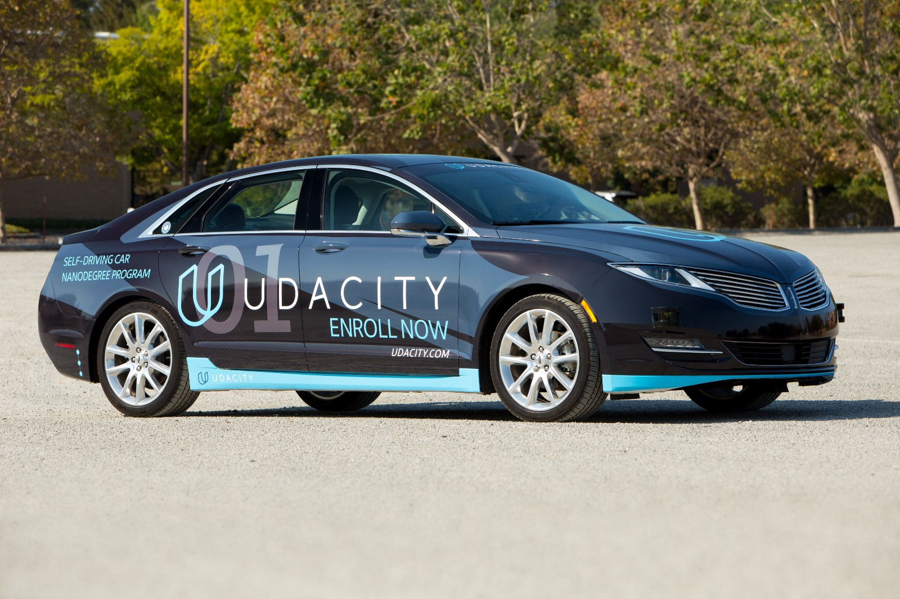

## Capstone Project - Programming a Self-Driving Car



### YetAnotherTeam

Team Members

|Name   | email  |
| ------ | ------|
| Ilya Stepanov (**Team Lead**) | dev@ilyastepanov.com |
| Chaitanya Rajasekhar | chaitanyar5atp@gmail.com |
| Isabella Ni | hpnhxxwn@gmail.com |
| Deepak Zambre | deepak.zambre@gmail.com|
| Aaditya Prakash | phd1501201006@iiti.ac.in |


## Installation and Run Instructions

Please use **one** of the two installation options, either native **or** docker installation.

### Native Installation

* Be sure that your workstation is running Ubuntu 16.04 Xenial Xerus or Ubuntu 14.04 Trusty Tahir. [Ubuntu downloads can be found here](https://www.ubuntu.com/download/desktop).
* If using a Virtual Machine to install Ubuntu, use the following configuration as minimum:
  * 2 CPU
  * 2 GB system memory
  * 25 GB of free hard drive space

  The Udacity provided virtual machine has ROS and Dataspeed DBW already installed, so you can skip the next two steps if you are using this.

* Follow these instructions to install ROS
  * [ROS Kinetic](http://wiki.ros.org/kinetic/Installation/Ubuntu) if you have Ubuntu 16.04.
  * [ROS Indigo](http://wiki.ros.org/indigo/Installation/Ubuntu) if you have Ubuntu 14.04.
* [Dataspeed DBW](https://bitbucket.org/DataspeedInc/dbw_mkz_ros)
  * Use this option to install the SDK on a workstation that already has ROS installed: [One Line SDK Install (binary)](https://bitbucket.org/DataspeedInc/dbw_mkz_ros/src/81e63fcc335d7b64139d7482017d6a97b405e250/ROS_SETUP.md?fileviewer=file-view-default)
* install python dependencies: `pip install -r requirements.txt`

### Docker Installation
[Install Docker](https://docs.docker.com/engine/installation/)

Build the docker container
```bash
docker build . -t capstone
```

Run the docker file
```bash
docker run -p 4567:4567 -v $PWD:/capstone -v /tmp/log:/root/.ros/ --rm -it capstone
```

### Usage

1. Make and run styx
```bash
cd ros
catkin_make
source devel/setup.sh
roslaunch launch/styx.launch
```
2. Download and run the [Udacity Simulator](https://github.com/udacity/CarND-Capstone/releases).

## System Architecture Diagram


## Traffic light detection

Traffic light detector and classifier is based [YOLOv2 architecture](https://pjreddie.com/darknet/yolo/) implemented using [Darkflow](https://github.com/thtrieu/darkflow).

```
Source | Train? | Layer description                | Output size
-------+--------+----------------------------------+---------------
       |        | input                            | (?, 416, 416, 3)
 Init  |  Yep!  | conv 3x3p1_1  +bnorm  leaky      | (?, 416, 416, 16)
 Load  |  Yep!  | maxp 2x2p0_2                     | (?, 208, 208, 16)
 Init  |  Yep!  | conv 3x3p1_1  +bnorm  leaky      | (?, 208, 208, 32)
 Load  |  Yep!  | maxp 2x2p0_2                     | (?, 104, 104, 32)
 Init  |  Yep!  | conv 3x3p1_1  +bnorm  leaky      | (?, 104, 104, 64)
 Load  |  Yep!  | maxp 2x2p0_2                     | (?, 52, 52, 64)
 Init  |  Yep!  | conv 3x3p1_1  +bnorm  leaky      | (?, 52, 52, 128)
 Load  |  Yep!  | maxp 2x2p0_2                     | (?, 26, 26, 128)
 Init  |  Yep!  | conv 3x3p1_1  +bnorm  leaky      | (?, 26, 26, 256)
 Load  |  Yep!  | maxp 2x2p0_2                     | (?, 13, 13, 256)
 Init  |  Yep!  | conv 3x3p1_1  +bnorm  leaky      | (?, 13, 13, 512)
 Load  |  Yep!  | maxp 2x2p0_1                     | (?, 13, 13, 512)
 Init  |  Yep!  | conv 3x3p1_1  +bnorm  leaky      | (?, 13, 13, 1024)
 Init  |  Yep!  | conv 3x3p1_1  +bnorm  leaky      | (?, 13, 13, 512)
 Init  |  Yep!  | conv 1x1p0_1    linear           | (?, 13, 13, 40)
-------+--------+----------------------------------+---------------
```

The network, originally trained on COCO dataset, was re-trained on [Bosch small traffic light dataset](https://hci.iwr.uni-heidelberg.de/node/6132) and [custom Udacity simulator dataset](https://github.com/istepanov/udacity-traffic-light-dataset). More information about training is located [here](https://github.com/istepanov/darkflow-traffic-lights).
